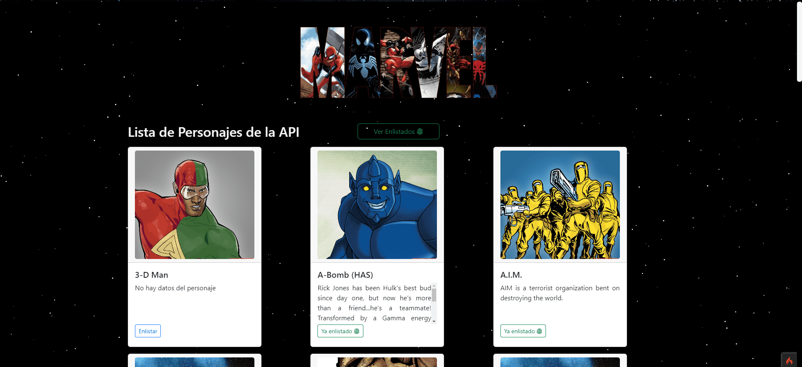
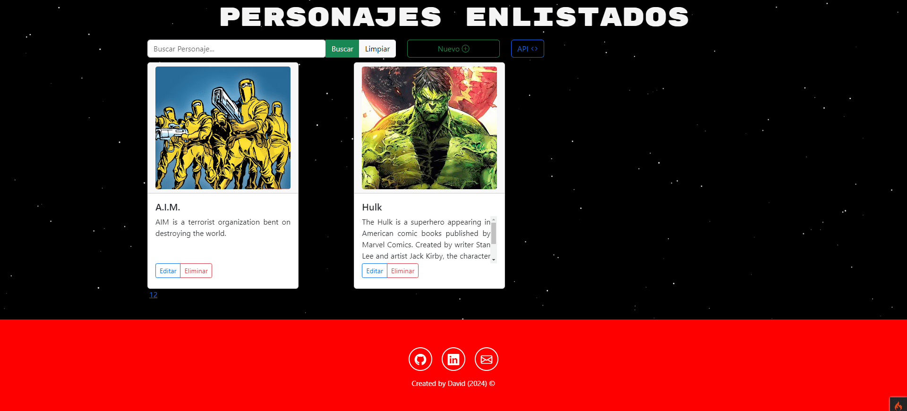

     
## Consumiendo API de Marvel Characters

     

---

## Descripcion 📙

    Aplicacion web desarrollada en CodeIgniter 4 🔥 en la cual se consume la API de Marvel para obtener personajes y guarda en una base de datos creada en MySQL. 

### API 🌐

La API de Marvel ofrece datos sobre miles de personajes, incluidos sus nombres, descripciones, imágenes y más. También proporciona información detallada sobre cómics, series y eventos relacionados con estos personajes.

[API Marvel Developer](https://developer.marvel.com/)

## Tecnologias ⚙

- HTML
- CSS
- JavaScript
- CodeIgniter
- MySQL

## Vistas 🏙

